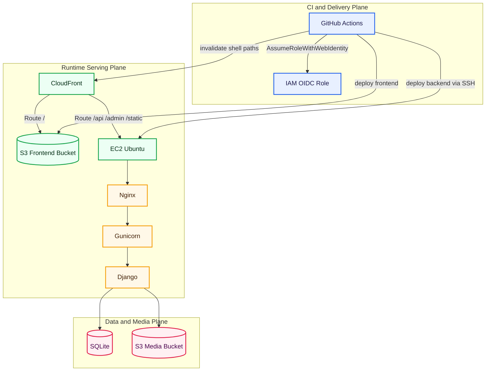

# Production Deployment Runbook

This document is the operational guide for provisioning and running this portfolio platform on AWS.

## Topology



## What Terraform Provisions

From `infra/terraform/`:

1. S3 frontend bucket (private, OAC access from CloudFront only).
2. S3 media bucket (public read for uploaded media).
3. CloudFront distribution with:
        - SPA rewrite function
        - `/api/*` -> EC2 origin (no cache)
        - `/admin/*` -> EC2 origin (no cache)
        - `/static/*` -> EC2 origin (cache enabled)
4. EC2 Ubuntu instance with an auto-assigned public IP.
5. IAM OIDC provider and CI/CD role(s).
6. GitHub repository rulesets.

## Prerequisites

1. AWS account.
2. Terraform Cloud org/workspace.
3. GitHub repository with Actions enabled.
4. Local tools:
        - Terraform >= 1.6
        - AWS CLI
        - SSH client

## Step 1: Configure Terraform Cloud

`versions.tf` is configured for Terraform Cloud backend and requires editing:

1. Set `organization` in `infra/terraform/versions.tf`.
2. Ensure workspace name `portfolio` exists in Terraform Cloud.
3. Add workspace variables:
        - Terraform vars: `ec2_public_key`, `django_secret_key`, `django_allowed_hosts`, `github_token`, `github_repo_url`, bucket names, etc.
        - Environment vars: `AWS_ACCESS_KEY_ID`, `AWS_SECRET_ACCESS_KEY`, `AWS_DEFAULT_REGION`.

## Step 2: Prepare Terraform Inputs

Edit `infra/terraform/terraform.tfvars` from example:

- `aws_region`
- `ec2_public_key`
- `allowed_ssh_cidrs`
- `django_secret_key`
- `django_allowed_hosts`
- `frontend_bucket_name`
- `media_bucket_name`
- `github_owner`, `github_repo_name`, `github_repo_url`, `github_token`
- optional domain settings (`domain_name`, `hosted_zone_id`, etc.)

## Step 3: Provision Infra

```bash
cd infra/terraform
terraform init
terraform validate
terraform plan
terraform apply
```

Capture outputs:

```bash
terraform output
```

Important outputs:

- `github_actions_role_arn`
- `budget_check_role_arn`
- `cloudfront_distribution_id`
- `cloudfront_domain`
- `ec2_public_ip`
- `frontend_bucket_name`
- `media_bucket_name`

## Step 4: Configure GitHub Secrets And Variables

### Required Secrets

Core deploy/runtime:

- `AWS_ROLE_ARN`
- `AWS_BUDGET_ROLE_ARN`
- `AWS_REGION`
- `EC2_HOST`
- `EC2_SSH_KEY`
- `S3_BUCKET_FRONTEND`
- `CLOUDFRONT_DISTRIBUTION_ID`
- `CLOUDFRONT_DOMAIN`
- `DB_ENGINE`
- `DB_NAME`
- `DB_USER`
- `DB_PASSWORD`
- `DB_HOST`
- `DB_PORT`
- `DB_SSLMODE`

PR checks:

- `TF_API_TOKEN`
- `INFRACOST_API_KEY`

Seed workflow:

- `DJANGO_SUPERUSER_PASSWORD`

Contact email pipeline:

- `EMAIL_HOST`
- `EMAIL_PORT`
- `EMAIL_HOST_USER`
- `EMAIL_HOST_PASSWORD`
- `EMAIL_USE_TLS`
- `DEFAULT_FROM_EMAIL`
- `CONTACT_NOTIFICATION_EMAIL`
- `CONTACT_SUBMIT_RATE`
- `CONTACT_MIN_FORM_FILL_MS`

### Required Repo Variable

- `BUDGET_THRESHOLD_USD` (example `10`)

## Step 5: First Deploy Path

`deploy-app.yml` handles both frontend and backend deploy automatically.

Trigger options:

1. Push to `main` with relevant file changes.
2. Manual run from Actions tab (`workflow_dispatch`).

Deploy behavior:

1. Detects changed paths (`dorny/paths-filter`).
2. Runs frontend job only if frontend changed.
3. Runs backend job only if backend changed.
4. Health check runs if either deploy succeeds.

Frontend deploy:

- Build with `VITE_API_URL=/api`.
- Sync hashed assets to S3 with immutable cache headers.
- Upload `index.html` with no-cache.
- Invalidate CloudFront `/` and `/index.html`.

Backend deploy:

- Temporary SSH ingress for runner IP.
- Pull latest `main` on EC2.
- Install Python dependencies.
- Run migrations.
- Collect static files and publish to `/var/www/portfolio/staticfiles`.
- Sync service configs (`portfolio-gunicorn.service`, `nginx.conf`).
- Patch `.env` values (`ALLOWED_HOSTS`, `CLOUDFRONT_DOMAIN`, email/contact settings).
- Restart Gunicorn and reload Nginx.
- Invalidate `/static/*` and `/admin/*`.

## Step 6: Post-Deploy Verification

1. Frontend: `https://<cloudfront-domain>/`
2. API health: `https://<cloudfront-domain>/api/profile/me/`
3. Admin: `https://<cloudfront-domain>/admin/`
4. Contact form:
        - saves message in admin
        - sends email if SMTP settings are valid

## Database Seeding Workflow

Manual Actions workflow: `seed-database.yml`

Features:

1. Loads `backend/content/fixtures/initial_data.json` into EC2 database.
2. Optional superuser creation from workflow inputs.
3. Uses OIDC and temporary SSH ingress rule.

## SQLite To RDS Migration

Use the manual workflow `migrate-sqlite-to-rds.yml` after RDS is provisioned and secrets are configured.

Flow:

1. Snapshot current SQLite-backed content on EC2.
2. Update backend `.env` with PostgreSQL connection settings.
3. Run Django migrations against RDS.
4. Import the snapshot into RDS.
5. Restart Gunicorn.

## Runbook Commands (EC2)

Check services:

```bash
sudo systemctl status portfolio-gunicorn
sudo systemctl status nginx
```

Check logs:

```bash
sudo journalctl -u portfolio-gunicorn -n 100 --no-pager
sudo tail -n 100 /var/log/gunicorn-error.log
sudo tail -n 100 /var/log/gunicorn-access.log
```

Manual migrate/collectstatic:

```bash
cd /home/ubuntu/portfolio/backend
source venv/bin/activate
python manage.py migrate --noinput
python manage.py collectstatic --noinput
sudo systemctl restart portfolio-gunicorn
sudo systemctl reload nginx
```

## Security Notes

1. CI/CD uses OIDC role assumption instead of long-lived AWS keys.
2. EC2 requires IMDSv2.
3. Security groups are temporarily opened for deploy runner and then revoked.
4. Branch protection uses required status checks from Terraform-managed ruleset.

## Cost Notes

1. CloudFront defaults to `PriceClass_200` for better India/Asia latency balance.
2. Budget gate fails PR when month-to-date spend exceeds threshold.
3. Some optional AWS controls are intentionally omitted for cost reasons (documented via Trivy ignores).

## Common Failure Modes

### 1) API path returns HTML

Cause: CloudFront `/api/*` not routing to EC2.

Action: Verify CloudFront behaviors in Terraform and apply.

### 2) Contact form does not send email

Cause: missing/invalid SMTP secrets.

Action:

1. Verify GitHub secrets.
2. Re-run deploy backend job.
3. Inspect `.env` on EC2 and test SMTP credentials.

### 3) 400 DisallowedHost on backend

Cause: host not present in `ALLOWED_HOSTS`.

Action: re-run backend deploy so `.env` patching updates hosts.

### 4) Admin static styling broken

Cause: static files not collected/published.

Action: run collectstatic and verify `/var/www/portfolio/staticfiles` ownership/permissions.

## Change Management Checklist

Before merge:

1. `npm run build` passes.
2. `python manage.py check` passes.
3. New model fields include migrations.
4. Any new runtime setting is reflected in:
        - `backend/portfolio_api/settings.py`
        - workflow secret/env patching logic in `deploy-app.yml`
        - docs (README/DEPLOY).
