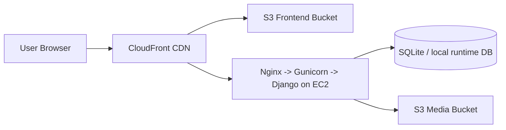

# Manoj Tech Solutions Portfolio

Production-ready personal portfolio platform powered by React, Django, AWS, and Terraform.


## What This Repo Contains

- Frontend SPA: React + Vite in `frontend/`
- Backend CMS/API: Django + DRF in `backend/`
- Infrastructure as code: Terraform in `infra/terraform/`
- Deployment automation: GitHub Actions workflows in `.github/workflows/`

## Live Architecture



## Platform Architecture & Tooling in Practice (New)

The homepage now includes a structured, admin-driven system-design section:

- Section title: `Platform Architecture & Tooling in Practice`
- System overview block with diagram placeholder
- Collapsible deep-dive cards powered by `ToolArchitecture` model
- Each card includes:
  - Role in System
  - Typical Setup
  - How It Works
  - Communication / Integration
  - Design Decisions / Trade-offs

## Data Model Updates

New model added:

- `ToolArchitecture`
  - `name`
  - `order`
  - `role`
  - `setup`
  - `usage`
  - `communication`
  - `tradeoffs`

Admin + API support:

- Admin UI: `content.ToolArchitecture` form in Django admin
- API endpoint: `GET /api/tool-architecture/` sorted by `order`

## Resume-Aligned Data Population

A command is included to populate profile, stats, skills, experience, and tool architecture cards from your resume baseline.

```bash
cd backend
python manage.py populate_resume_data
```

After running, fixture can be regenerated (used by seed workflow):

```bash
cd backend
$env:PYTHONUTF8="1"
python manage.py dumpdata content --natural-foreign --natural-primary --indent 2 -o content/fixtures/initial_data.json
```

## Startup Loading UX

Home now displays an explicit loading state on first load:

- `Loading portfolio experience...`
- `Fetching profile and platform sections`

This is rendered while profile bootstrap data is fetched.

## CDN Caching Improvements (Prepared for Tomorrow Apply)

Terraform changes are included (not applied yet):

- Added CloudFront behavior for `/assets/*`
  - 1-year cache for hashed Vite assets
- Added CloudFront behavior for `/media/*`
  - media served through CloudFront instead of direct S3 latency path
- Updated default behavior TTL
  - HTML remains fresh (`default_ttl=300`)
- Changed default CloudFront `price_class` to `PriceClass_200`
  - improves latency for India compared to `PriceClass_100`

## Important Media URL Fix

Production Django now uses unsigned media URLs for public media:

- `AWS_QUERYSTRING_AUTH = False`
- `MEDIA_URL` can be set via `MEDIA_CDN_URL` (defaults to `/media/`)

This removes expiring signed-query media URLs and improves cacheability.

## Local Development

### Prerequisites

- Node.js 20+
- Python 3.11+

### Setup

```bash
./setup.sh
```

### Run backend

```bash
cd backend
python manage.py runserver
```

### Run frontend

```bash
cd frontend
npm run dev
```

## Validation Commands

Backend checks:

```bash
cd backend
python manage.py check
```

Frontend build:

```bash
cd frontend
npm run build
```

Terraform format check:

```bash
cd infra/terraform
terraform fmt -check
terraform validate
```

## Deployment Workflows

- App deploy: `.github/workflows/deploy-app.yml`
- DB seed: `.github/workflows/seed-database.yml`
- PR checks: `.github/workflows/pr-checks.yml`

## Tomorrow Apply Checklist (Infra)

1. Pull latest `main`
2. Run Terraform plan/apply in Terraform Cloud
3. Confirm CloudFront behaviors:
   - `/assets/*`
   - `/media/*`
4. Set backend env:
   - `MEDIA_CDN_URL=/media/`
5. Invalidate CloudFront cache once after deployment
6. Verify site from India region:
   - static load speed
   - media load speed
   - API response path via CloudFront

## Notes

- No client-sensitive data is committed.
- Section content is structured and editable from admin.
- Tool details are intentionally system-focused and scalable for future additions.
