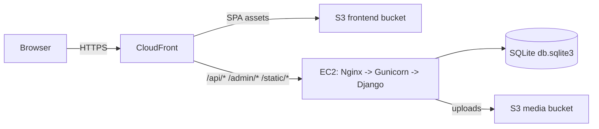

# Portfolio (React + Django + Terraform + AWS)

A full-stack personal portfolio site with a CMS-style admin panel.

- **Frontend:** React (Vite) deployed to **S3** and served via **CloudFront**
- **Backend:** Django + DRF served by **Gunicorn** behind **Nginx** on **EC2**
- **Infrastructure:** Terraform (remote runs in Terraform Cloud)
- **CI/CD:** GitHub Actions with PR gates (lint/fmt, cost checks, security scans) and automated deploys

This repo is designed for a **solo developer workflow**: no reviewer requirements, but strong automated checks before merge.

---

## Quick start (production)

Use this checklist when setting up a new environment or when something looks “deployed but empty”.

### 1) Provision / update infra (Terraform Cloud)
- Run **Plan + Apply** in Terraform Cloud for the `portfolio` workspace.

### 2) Configure GitHub Secrets (Actions)
Minimum set to deploy:
- `AWS_ROLE_ARN`, `AWS_REGION`
- `EC2_HOST`, `EC2_SSH_KEY`
- `S3_BUCKET_FRONTEND`, `CLOUDFRONT_DISTRIBUTION_ID`, `CLOUDFRONT_DOMAIN`
- `API_BASE_URL` = `https://<cloudfront-domain>/api`

Minimum set for PR gates:
- `TF_API_TOKEN`, `INFRACOST_API_KEY`, `AWS_BUDGET_ROLE_ARN`

### 3) Merge to main
- Open PR → wait for required checks to pass → merge.

### 4) Seed content (one-time per new server)
- Run the manual workflow **Seed Database** (`seed-database.yml`) to load the fixture into EC2.
- Or SSH to EC2 and run `python manage.py loaddata ...`.

### 5) Validate
- Frontend: open `https://<cloudfront-domain>/`
- API: `https://<cloudfront-domain>/api/`
- Admin: `https://<cloudfront-domain>/admin/`

---

## What this project does

### End-user site
- Landing page with about/skills/experience/projects/blog/contact sections
- Pages for Projects and Blog
- Contact form posting into the backend

### Admin (CMS)
- Django Admin (Jazzmin theme)
- Create/update:
	- Profile
	- Skills (grouped)
	- Experience
	- Projects
	- Blog posts
	- Activities
	- Certifications
	- Contact messages (inbox)

### API
- Django REST Framework endpoints under `/api/`
- JWT endpoints under `/api/token/` and `/api/token/refresh/`

---

## Architecture



Notes:
- CloudFront terminates TLS for viewers.
- The backend origin runs HTTP internally (Nginx proxies to Gunicorn on `127.0.0.1:8000`).
- In production (`DEBUG=False`) media uploads are stored in S3 via `django-storages`.

---

## Repo layout

- `frontend/` — React app (Vite)
- `backend/` — Django project + DRF API
- `infra/terraform/` — Terraform for AWS + GitHub rulesets
- `infra/nginx.conf` — Nginx site config for EC2
- `infra/portfolio-gunicorn.service` — systemd unit for Gunicorn
- `.github/workflows/` — CI/CD workflows

---

## Local development

### Prerequisites
- Node.js 20+
- Python 3.11+

### Quick setup

From the repo root:

```bash
./setup.sh
```

This will:
- create a Python venv
- install backend deps
- create `backend/.env` from `backend/.env.example`
- migrate DB
- prompt you to create a Django superuser
- install frontend deps

### Run locally

Backend:

```bash
cd backend
source venv/bin/activate  # Windows: venv\\Scripts\\activate
python manage.py runserver
```

Frontend (dev server with proxy `/api` -> Django):

```bash
cd frontend
npm run dev
```

Local URLs:
- Frontend: `http://localhost:5173/`
- Admin: `http://localhost:8000/admin/`
- API: `http://localhost:8000/api/`

---

## Content seeding / exporting

The site content is stored in the backend DB. For convenience, this repo also supports a fixture-based workflow.

### Export content from local DB

```bash
cd backend
export PYTHONUTF8=1  # PowerShell: $env:PYTHONUTF8="1"
python manage.py dumpdata content \
	--natural-foreign --natural-primary --indent 2 \
	-o content/fixtures/initial_data.json
```

### Load content on EC2

On the EC2 instance:

```bash
cd /home/ubuntu/portfolio/backend
source venv/bin/activate
python manage.py loaddata content/fixtures/initial_data.json
```

---

## Infrastructure (Terraform)

Terraform lives in `infra/terraform/` and is designed to run via **Terraform Cloud**.

### What Terraform provisions
- S3 bucket for frontend assets
- CloudFront distribution
- EC2 instance (Ubuntu) running Nginx + Gunicorn + Django
- S3 bucket for media uploads
- IAM roles/policies for GitHub Actions OIDC
- GitHub repository rulesets (required checks gate on PRs)

### Terraform Cloud (TFC)
- Remote execution is expected
- Apply is done in TFC

See comments in `infra/terraform/versions.tf` for the expected workspace setup.

---

## CI/CD

### PR gates (required before merge)
Workflow: `.github/workflows/pr-checks.yml`

Checks enforced via GitHub ruleset:
- Secret scanning (Gitleaks)
- Terraform formatting, linting, validate, and a speculative plan
- Frontend build + backend Django deploy checks
- Infracost cost estimate and diff on PR
- Trivy filesystem scan (HIGH/CRITICAL)

### Budget gate
Workflow: `.github/workflows/budget-check.yml`

- Uses AWS Cost Explorer to fetch month-to-date spend
- Fails the PR if current spend exceeds the budget threshold
- Threshold is controlled via repo variable `BUDGET_THRESHOLD_USD` (defaults to 10)

### Deploy
Workflow: `.github/workflows/deploy-app.yml`

Triggers on push to `main` when changes touch:
- `frontend/**`
- `backend/**`
- `infra/**`
- `.github/workflows/deploy-app.yml`

Deploy steps:
- Frontend: build -> sync to S3 -> CloudFront invalidation
- Backend: SSH to EC2 -> install deps -> migrate -> collectstatic -> restart Gunicorn

The backend deploy contains guardrails learned from production troubleshooting:
- auto-install systemd unit if missing
- check for `.env`
- patch `ALLOWED_HOSTS` and `CLOUDFRONT_DOMAIN` at deploy time
- ensure Gunicorn log files exist and are writable
- print `systemctl status` and `journalctl` on failure

### Seed EC2 DB
Workflow: `.github/workflows/seed-database.yml` (manual `workflow_dispatch`)

- Loads `backend/content/fixtures/initial_data.json` into EC2
- Optionally creates a superuser

---

## GitHub ruleset (solo dev friendly)

Terraform config: `infra/terraform/github.tf`

Key behavior:
- **No approver requirement** (`required_approving_review_count = 0`)
- Merge is gated by required checks only
- **Signed commits** can be enforced by enabling “Require signed commits” in the ruleset

If you enforce signed commits, you must configure local GPG signing before merging.

---

## Required GitHub Secrets / Variables

### Secrets (Actions)

| Secret | Used by | Purpose |
|---|---|---|
| `AWS_ROLE_ARN` | Deploy | OIDC role for deploy to AWS (S3/CloudFront/EC2 SG rule) |
| `AWS_BUDGET_ROLE_ARN` | Budget Gate | OIDC role with Cost Explorer read |
| `AWS_REGION` | All | AWS region |
| `EC2_HOST` | Deploy | EC2 public IP/DNS for SSH |
| `EC2_SSH_KEY` | Deploy | Private SSH key for EC2 |
| `S3_BUCKET_FRONTEND` | Deploy | Frontend S3 bucket name |
| `CLOUDFRONT_DISTRIBUTION_ID` | Deploy | CloudFront distribution id |
| `CLOUDFRONT_DOMAIN` | Deploy/Health | CloudFront domain name (e.g. `d123...cloudfront.net`) |
| `API_BASE_URL` | Deploy | Value injected into frontend build (should be `https://<cloudfront-domain>/api`) |
| `TF_API_TOKEN` | PR Checks | Terraform Cloud API token for speculative plan |
| `INFRACOST_API_KEY` | PR Checks | Infracost API key |
| `DJANGO_SUPERUSER_PASSWORD` | Seed DB | Password for automatic superuser creation |

### Variables

| Variable | Where | Purpose |
|---|---|---|
| `BUDGET_THRESHOLD_USD` | Repo variable | Monthly spend threshold (default 10) |

---

## Troubleshooting

### CloudFront `/api/*` returns HTML (React app) instead of JSON
Cause: CloudFront behavior for `/api/*` is still pointing to S3 (SPA origin).

Fix:
- Apply the Terraform change that adds EC2 as an origin and routes `/api/*` to it.

Quick test:

```bash
curl -I https://<cloudfront-domain>/api/
```

If the response is `text/html`, the behavior is still on S3.

### EC2 returns `400 Bad Request`
Cause: Django `DisallowedHost` (missing `ALLOWED_HOSTS`).

Fix:
- Ensure EC2 public IP/DNS and CloudFront domain are in `backend/.env`.

### Nginx routes missing (`/api` and `/admin` 404 on EC2)
Cause: Nginx site config not installed or not enabled.

Fix:

```bash
sudo cp /home/ubuntu/portfolio/infra/nginx.conf /etc/nginx/sites-available/portfolio
sudo ln -sf /etc/nginx/sites-available/portfolio /etc/nginx/sites-enabled/portfolio
sudo rm -f /etc/nginx/sites-enabled/default
sudo nginx -t && sudo systemctl reload nginx
```

### Gunicorn won’t start due to log permissions
Cause: `/var/log/gunicorn-*.log` not writable.

Fix:

```bash
sudo touch /var/log/gunicorn-access.log /var/log/gunicorn-error.log
sudo chown ubuntu:ubuntu /var/log/gunicorn-access.log /var/log/gunicorn-error.log
sudo systemctl restart portfolio-gunicorn
```

---

## License

This repository is intended for personal portfolio use. Add a license if you plan to open-source it.

