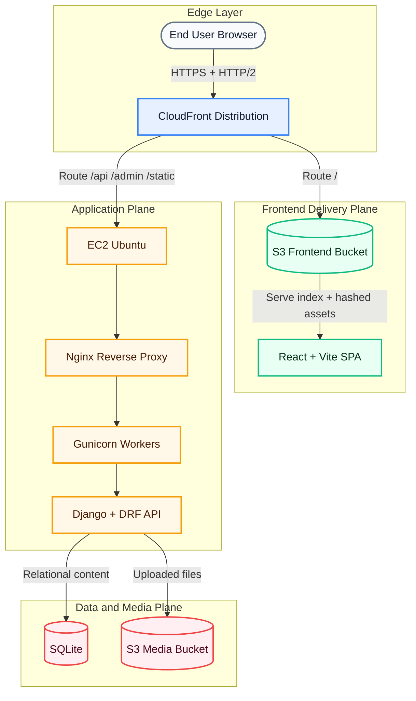

# Manoj Portfolio Platform


<p align="center">
  
</p>

Production-ready portfolio platform with:

- React + Vite frontend
- Django + DRF backend
- Admin-driven content management (Jazzmin)
- AWS deployment (S3 + CloudFront + EC2 + Nginx + Gunicorn)
- Terraform-managed infrastructure and GitHub repository rules
- CI/CD via GitHub Actions with cost + security checks

This repository is admin-first: most site content and section labels are editable from Django Admin without frontend code changes.

## Table Of Contents

1. [System Overview](#system-overview)
2. [Request Flow](#request-flow)
3. [Repository Layout](#repository-layout)
4. [Features](#features)
5. [Data Model Summary](#data-model-summary)
6. [API Surface](#api-surface)
7. [Environment Variables](#environment-variables)
8. [Local Development](#local-development)
9. [Content Operations](#content-operations)
10. [CI/CD And Quality Gates](#cicd-and-quality-gates)
11. [Deployment Summary](#deployment-summary)
12. [Issue Triage Matrix](#issue-triage-matrix)
13. [Troubleshooting](#troubleshooting)
14. [Newcomer Checklist](#newcomer-checklist)

## System Overview



Core architecture decisions:

- Frontend and API share the same public domain via CloudFront path behaviors.
- CloudFront default behavior serves SPA from S3 with long-lived caching for hashed assets.
- API/Admin/Static are routed to EC2 origin with no cache for dynamic routes.
- Media uploads are served from S3 in production (`DEBUG=False`).

## Request Flow

### Frontend

1. Browser requests root URL.
2. CloudFront serves `index.html` and static assets from S3.
3. React app calls same-origin `/api/*` (via Axios base URL normalization).

### Backend API

1. CloudFront forwards `/api/*` to EC2 origin.
2. Nginx proxies to Gunicorn (`127.0.0.1:8000`).
3. Django/DRF returns JSON.

### Contact Form

1. React submits `/api/contact/`.
2. Backend validates:
   - honeypot field
   - minimum form fill time
   - rate limit throttle by IP
3. Message is stored in DB.
4. Email notification is attempted (SMTP, fail-safe).

## Repository Layout

- `frontend/`: React application (sections, routes, API client).
- `backend/`: Django project, content app, API, admin, migrations.
- `infra/`: Nginx config, Gunicorn service, Terraform templates/modules.
- `.github/workflows/`: deploy pipelines, PR checks, budget gate, seeding.
- `DEPLOY.md`: detailed production deployment runbook.

## Features

### Content-Managed Sections

- Hero, About, Architecture, Current Focus
- Experience, Projects, Blog, Certifications
- Open Source Contributions, Contact

### Admin-Driven CMS

Managed from Django Admin:

- Profile and section copy fields
- Profile stats
- Skills with custom icon upload support
- Projects with architecture diagrams and notes
- Architecture entries and tool architecture cards
- Experiences, activities, blog posts, certifications
- Open source contribution entries
- Contact inbox

### Frontend UX Enhancements

- Section skeleton loaders
- Background image preload loader
- Avatar image loader with spinner/fallback
- Expandable architecture/project details
- Diagram modal preview for architecture images
- Placeholder rendering for empty sections (certifications/open source)

## Data Model Summary

Primary content models in `content` app:

- `Profile`: global site/profile copy and metadata.
- `ProfileStat`: hero statistics.
- `Skill`: categorized skills + optional custom icon upload.
- `Project`: project details, links, stack, architecture diagram + notes.
- `ArchitectureEntry`, `ToolArchitecture`: architecture storytelling.
- `CurrentFocusItem`: active focus list.
- `Experience`, `BlogPost`, `Activity`, `Certification`.
- `OpenSourceContribution`: open source section data.
- `ContactMessage`: inbound contact submissions.

## API Surface

Base path: `/api/`

Read endpoints:

- `/profile/me/`
- `/skills/`, `/skills/grouped/`, `/skills/featured/`
- `/architecture/`, `/tool-architecture/`, `/current-focus/`
- `/projects/`, `/projects/<slug>/`
- `/experience/`
- `/blog/`, `/blog/<slug>/`
- `/activities/`
- `/certifications/`
- `/open-source/`

Write endpoint:

- `/contact/` (POST only)

Auth endpoints:

- `/api/token/`
- `/api/token/refresh/`

## Environment Variables

### Backend Core

- `SECRET_KEY`
- `DEBUG`
- `ALLOWED_HOSTS`
- `CLOUDFRONT_DOMAIN`

### S3 Media

- `AWS_STORAGE_BUCKET_NAME`
- `AWS_S3_REGION_NAME`
- `AWS_ACCESS_KEY_ID` and `AWS_SECRET_ACCESS_KEY` (optional when using EC2 instance profile)

### Contact Email

- `EMAIL_BACKEND`
- `EMAIL_HOST`
- `EMAIL_PORT`
- `EMAIL_HOST_USER`
- `EMAIL_HOST_PASSWORD`
- `EMAIL_USE_TLS`
- `EMAIL_USE_SSL`
- `DEFAULT_FROM_EMAIL`
- `CONTACT_NOTIFICATION_EMAIL`

### Contact Anti-Spam

- `CONTACT_SUBMIT_RATE` (example `3/hour`)
- `CONTACT_MIN_FORM_FILL_MS` (default `2500`)
- `CONTACT_REQUIRE_FORM_TIMING` (`True`/`False`)

## Local Development

### Prerequisites

- Python 3.11+
- Node.js 20+

### One-command Setup

```bash
./setup.sh
```

What `setup.sh` does:

1. Creates Python virtualenv (`backend/venv`).
2. Installs backend dependencies.
3. Copies `backend/.env.example` to `backend/.env` if missing.
4. Runs migrations.
5. Prompts for Django superuser creation.
6. Runs `collectstatic`.
7. Installs frontend dependencies.

### Run Locally

Backend:

```bash
cd backend
source venv/bin/activate
python manage.py runserver
```

Frontend:

```bash
cd frontend
npm run dev
```

Local URLs:

- Frontend: `http://localhost:5173`
- Admin: `http://localhost:8000/admin/`
- API: `http://localhost:8000/api/`

## Content Operations

### Clear Data (development only)

```bash
cd backend
python manage.py seed_data --clear
```

### Snapshot Current Content

```bash
cd backend
python manage.py snapshot_data
```

Custom output path:

```bash
python manage.py snapshot_data --output snapshots/portfolio_snapshot.json
```

### Restore Data

```bash
python manage.py loaddata backend/content/fixtures/initial_data.json
```

## CI/CD And Quality Gates

### Main Workflows

- `pr-checks.yml`: lint/validate/security/cost checks.
- `budget-check.yml`: monthly AWS cost threshold gate.
- `deploy-app.yml`: frontend + backend deploy.
- `seed-database.yml`: manual fixture load to EC2.

### Required Checks (branch ruleset)

- Secret Scan (Gitleaks)
- Terraform Checks
- App Build Check
- App Health Check
- Infracost Cost Estimate
- Security Scan (Trivy)
- Monthly AWS Cost Check

## Deployment Summary

For full details see `DEPLOY.md`.

High-level flow:

1. Terraform provisions infrastructure and IAM/OIDC wiring.
2. GitHub Actions assumes AWS roles via OIDC.
3. Frontend deploy job publishes to S3 and invalidates CloudFront shell paths.
4. Backend deploy job SSHes to EC2, updates code, migrates, collects static, restarts services.
5. Health check validates API and frontend availability.

## Issue Triage Matrix

Use this quick map to jump to the right diagnostic path:

| Symptom | Likely Scope | First Checks | Primary Reference |
|---|---|---|---|
| Frontend blank/old UI | S3/CloudFront/frontend deploy | latest deploy run, S3 object upload, CloudFront invalidation | [DEPLOY.md](DEPLOY.md#step-5-first-deploy-path) |
| `/api/*` returns HTML | CloudFront behavior routing | `/api/*` behavior origin, Terraform drift | [DEPLOY.md](DEPLOY.md#1-api-path-returns-html) |
| Contact saved but no email | SMTP/runtime env sync | email secrets, EC2 `.env`, provider auth | [DEPLOY.md](DEPLOY.md#2-contact-form-does-not-send-email) |
| `DisallowedHost` or 400 | Django env hosts config | `ALLOWED_HOSTS`, deploy env patching | [DEPLOY.md](DEPLOY.md#3-400-disallowedhost-on-backend) |
| Admin styles missing | collectstatic/publish step | staticfiles dir, permissions, collectstatic rerun | [DEPLOY.md](DEPLOY.md#4-admin-static-styling-broken) |
| Deploy failed mid-run | service/runtime health | Gunicorn status, Nginx reload, journal logs | [DEPLOY.md](DEPLOY.md#runbook-commands-ec2) |
| PR blocked unexpectedly | quality gates | failed required check, budget threshold, security scan | [README.md](README.md#cicd-and-quality-gates) |

## Troubleshooting

### Contact form saved but no email received

Check:

1. SMTP secrets/`.env` values.
2. `CONTACT_NOTIFICATION_EMAIL` is set.
3. Mail provider spam/junk folder.

### API returns HTML instead of JSON

CloudFront behavior misroute likely points `/api/*` to S3. Verify `cloudfront.tf` behavior and apply Terraform.

### Admin static broken

Run on EC2:

```bash
cd /home/ubuntu/portfolio/backend
source venv/bin/activate
python manage.py collectstatic --noinput
sudo systemctl restart portfolio-gunicorn
sudo systemctl reload nginx
```

### Gunicorn failed after deploy

```bash
sudo systemctl status portfolio-gunicorn --no-pager -l
sudo journalctl -u portfolio-gunicorn -n 100 --no-pager
```

## Newcomer Checklist

1. Read this README and `DEPLOY.md`.
2. Run local setup with `./setup.sh`.
3. Open admin and inspect content models.
4. Review API client in `frontend/src/api/index.js`.
5. Review workflows in `.github/workflows/`.
6. Review Terraform variables/outputs before infra changes.

## License

Personal portfolio codebase. Add an explicit OSS license if you plan to publish/reuse openly.

